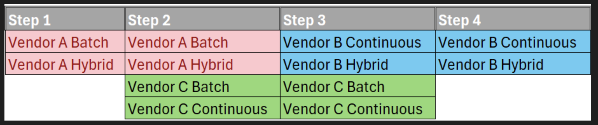
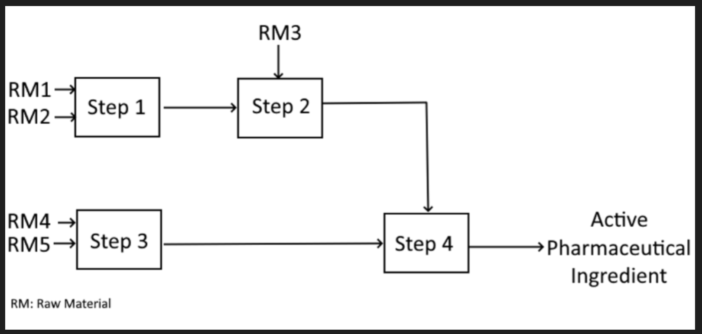
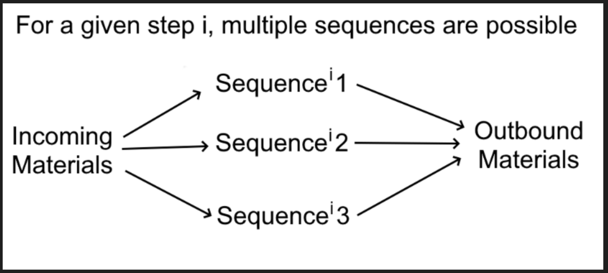
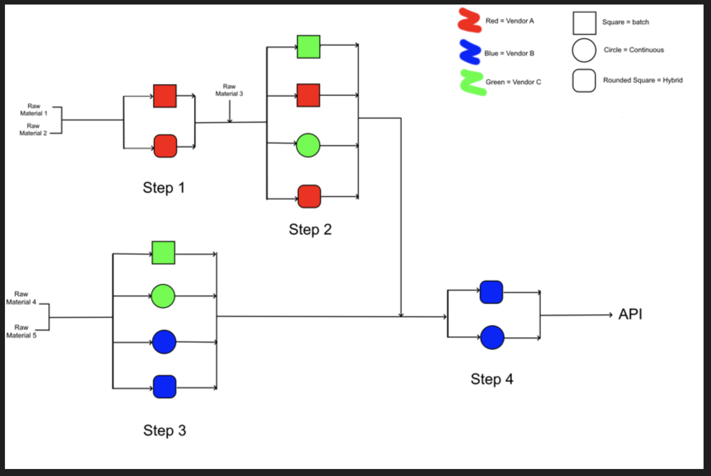

# Pharmaceutical Manufacturing Outsourcing Optimization
## Background
This project seeks to approach a common pharmaceutical industry challenge of scaling a drug to production after FDA approval. 
There is urgency in the process of scaling to production because after filing, the patent for the drug is only held by the company for 10 years 
and vertically integrating is no longer the most economically viable option. 3rd party vendors must be employed to sequentially 
build the molecule over many steps that results in the active pharmaceutical ingredient (API). Selection of these vendors can be 
a strenous and inefficient process to work out as dozens of steps is common to build an API, however if each vendor is modeled by a
set of parameters, computational optimization is the perfect tool to rapidly determine the third party vendor sequence for API 
construction that allows for the pharma company to realize the maximum profit the patent is able to produce within the 10 year period.

# Problem Description
A pharmaceutical company that has just patented an API and wishes to produce it via this synthesis pathway must outsource the steps to third party vendors to retain a competitive advantage. Third party vendors are individually capable of some steps via some synthesis pathways as displayed below. 

 For this problem the manufacturing process consists of the following flowsheet:

Considering the above flowsheet, in which raw materials are input to a sequence of steps, each step representing a unit operation type such as a reaction or separation. The final product of all of these steps is an Active Pharmaceutical Ingredient (API). For a given step it is possible to go from reagents to products represented by different sequences that encompass types of operations such as batch, hybrid, or continuous reactors (as seen below).

This means that the flowsheet can take any number of pathways as shown below. The challenge is determining the best vendors to assign to each step. Computational optimization provides a modern tool to efficiently determine the best vendor for each step by minmizing the cost necessary to produce the products from the reactants.

## Solution
### Solver
In this ipynb notebook we utilize the gurobi solver to identify the optimal site for each step of the process. The class reads in the CSVs. In the test-data-combo.csv CSV there is the production information for vendors in 4 columns: the step number, the vendor name, the production amount, and the production cost. The test-transport-data.csv contains the transport costs between the production sites for each step of the process. This CSV had 5 columns: the starting step, the ending step, the starting vendor, the ending vendor, and how much it cost to go between them. The optimizer class that was built ingests these CSVs and inputs them into the sovler. 

### Visualization
The second part of this notebook takes the output of the gurboi solver and uses it to construct a graph showing the optimal solution. It then will highlight the optimal path for between steps of the process. 